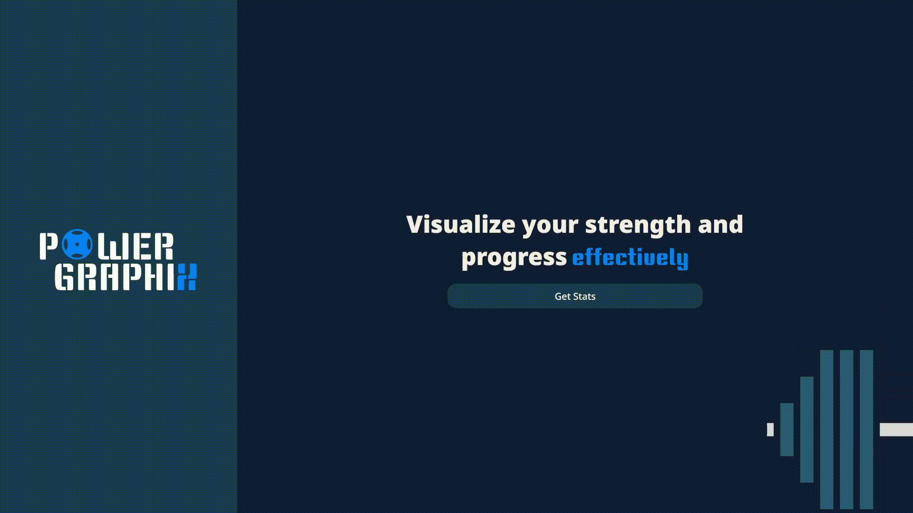
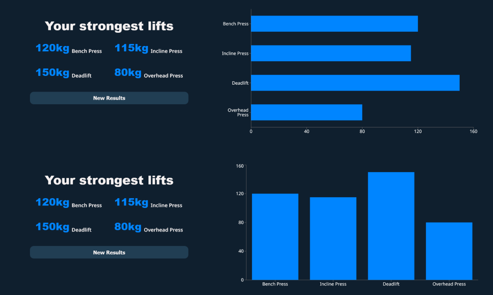
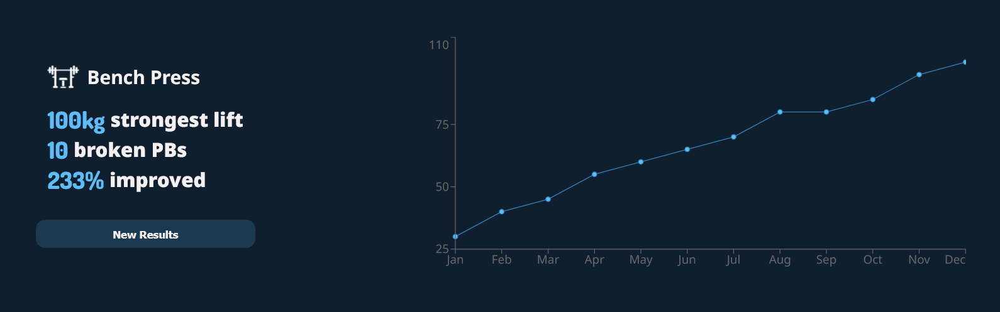

# Powergraphix

## What's it about?

Powergraphix lets you visualize all your progress at the gym by transforming your lifts 
into beautiful and detailed charts. Always wanted to see your strength increase on a certain exercise or
see all of your strongest lifts visualized? Powergraphix can get this done for you.

## What you can do

### See your strongest lifts come to life

You can input your PRs for up to 6 different exercises and chose from 4 different types of charts
to see your lifts come to life.

### Visualize your strength increase over time

Input your PRs for each month of the year for your favorite lifts and see how your strength has progressed over time.
You can chose from an extensive list of exercises and motivate yourself by seeing your progress right in front of you.

## Features:

- Extensive list of exercises to chose from
- Select up to 6 exercises and input your PRs for each and watch them come to life.
- Amoled theme toggle, if night theme is not dark enough for you.
- Chose between 4 different chart types for your ideal representation of your strongest lifts.
- Easily change/edit the data and easily change exercises that you want to see your progress in.
- Each chart is made to ignore the months you have not been active to not get discouraged.

## Live Demo 👉 [powergraphix](https://powergraphix.netlify.app/)

## Built With

### This application has been build using:

- Vite
- React
- react-router-dom
- styled-components
- recharts

## Libraries used:

- [phosphoricons](https://phosphoricons.com/) - Used for most of the icons on the page
- [react-router-dom](https://reactrouter.com/en/main) - Used for routing
- [Recharts](https://recharts.org/en-US/) - Used for all the charts on the page.

## Credits

Application was built by [atanasovCode](https://github.com/AtanasovCode/)

