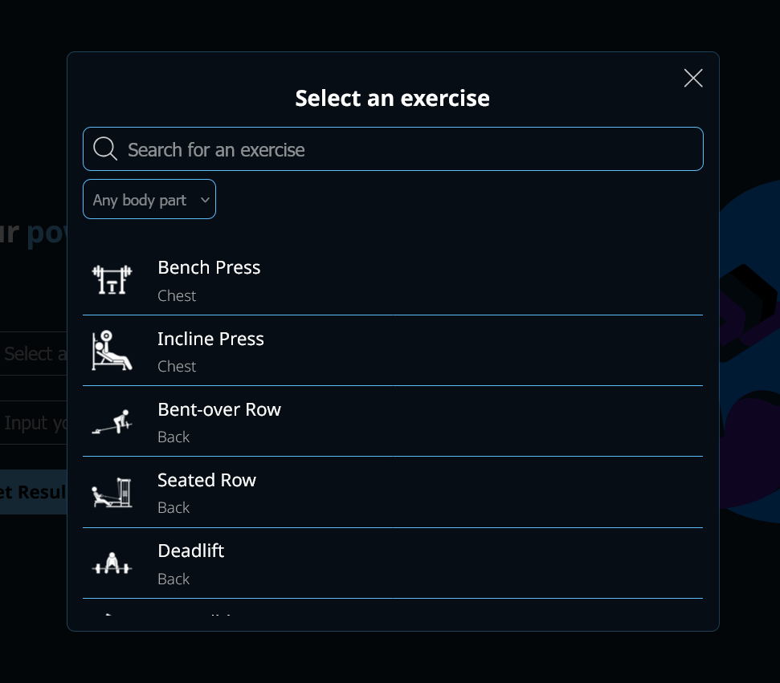

# Powergraphix

Powergraphix is a web application that provides users with an intuitive and visually rich platform for tracking their workouts and individual exercises. The application offers detailed statistics and charts to help users monitor their strength gains and keep track of their strongest lifts.

# You can:

- Input your strongest lift for each month of the year and visualize your progress with the help of a chart.
- See how many new PBs you have made and see what is your all-time strongest lift.
- Chose from a detailed list of exercises.
- 
- Track up to 6 different exercises and have visual representation of your strength.
- Chose between 4 different chart types for your ideal representation of your strongest lifts.
- Easily change/edit the data and easily change exercises that you want to see your progress in.
- Each chart is made to ignore the months you have not been active to not get discouraged.

# Visualize your strenght gain over time

# Live Demo

[powergraphix](https://powergraphix.netlify.app/)

# Built With

This application has been build using:

- Vite
- React
- TypeScript
- styled-components

# Libraries used:

- [phosphoricons](https://phosphoricons.com/) - Used for most of the icons on the page
- [react-router-dom](https://reactrouter.com/en/main) - Used for routing
- [Recharts](https://recharts.org/en-US/) - Used for all the charts on the page.

# Credits

Application was built by [atanasovCode](https://github.com/AtanasovCode/)
